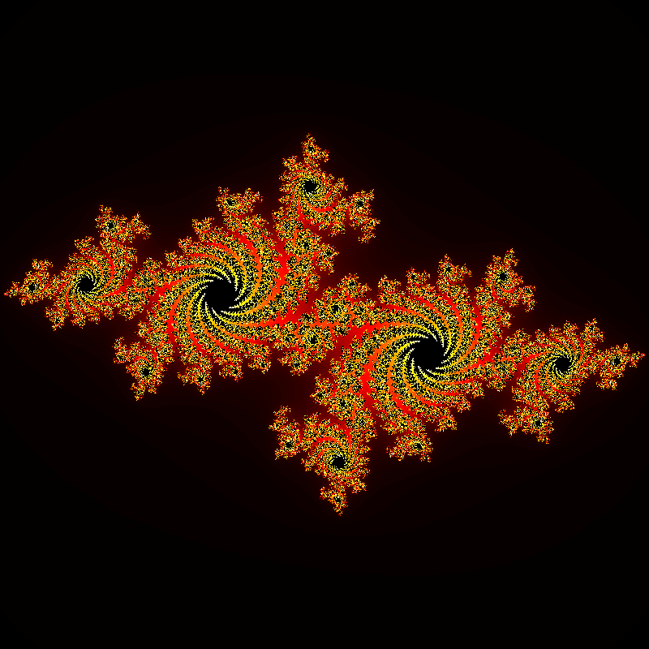

#  Interactive Julia set
> i suggest you use a mouse since it is harder to zoom in and out it with a mousepad

I decided to code the funcions of the Julia Set in C, then, i thought to myself, how can i show this? andi wanna make it cool and fun aswell...

That's when it hit me, i could use HTML and JavaScript to show the set!
 
## Timeline?
As i said, i started this with just a C file that  returned a PNG file with the pretty image of the Julia set (with c = -0.7 + 0.27015*i)

Then i thought it would be interesting to show it in a website, but i wanted to make it interactive, so i asked Claude how could i do that, and he answered "with javascript" and i said "aaa you're right!"

Ok, jokes aside, i left the C file since it was the begining and i didn't really know how to include it in my project so instead i embedded a part of my C code and did the rest with javascript.

## Features
You can zoom in or out with the mouse wheel or by pinching the screen or mousepad.

You can move the set by pressing over it and dragging it around.

At the right you'll find controllers for the zoom, variables and quality of the set.

### AI Use
> I used AI to figure out how to go from a C code to JavaScript while having all the functions i wanted and maintaining the math accurate.